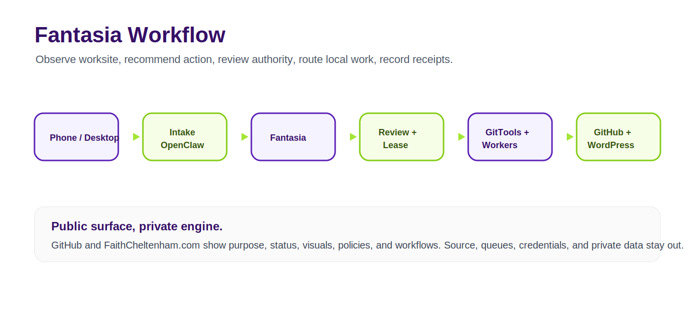

# F@ntas1@

Local-first AI operations desktop for safe creative automation and accountable agent work.

> This repository is a protected public project surface. It is not the full source code, operational system, private workflow, or data room.

## What Is This?

F@ntas1@ is Faith Cheltenham's local-first AI operations conductor. It helps a builder manage local, cloud-adjacent, and phone-connected AI workflows with receipts, authority boundaries, rollback thinking, and clear public/private separation.

The working private system coordinates a desktop app, local worksite analysis, AI Desk packets, OpenClaw phone handoffs, Codex-assisted and Codex-optional operator flows, GitTools readiness, and local worker lanes. This repository presents the public story, workflow, status, visuals, and ownership posture without releasing the private engine.

## Why It Matters

Most agent stacks blur control, authorship, and risk. F@ntas1@ is designed around a different operating model:

- local-first before cloud-first
- public surface, private engine
- receipts before claims
- explicit authority before action
- reversible local work before remote mutation
- Faith-owned strategy, memory, and IP

## Who It Is For

F@ntas1@ is for builders, operators, founders, creative technologists, and small teams who want AI agents to help manage work without giving them uncontrolled access to production systems, credentials, private archives, or public publishing channels.

## How It Works

1. Work enters from a desktop cockpit, local queue, or private phone lane.
2. F@ntas1@ reads approved local state and creates a recommendation or packet.
3. Low-risk work can move through an Operator Inbox, Dev Queue, AI Desk review, or Codex-assisted lane.
4. Local workers and GitTools operate only under scoped authority.
5. Every meaningful action returns as a review packet, audit receipt, or rollback note.
6. High-impact work remains blocked until Faith explicitly approves it.

## What Is Public

- Product description and positioning
- Workflow diagrams and public/private boundary
- Brand visuals and launch-gallery assets
- Status, roadmap, FAQ, and WordPress page draft
- Ownership, security, and commercial-use policy

## What Remains Private

- Desktop source code and private local adapters
- Raw queues, telemetry logs, leases, screenshots, and receipts
- Credentials, tokens, local configuration, deployment systems, and signing material
- Private Pepperdine coursework and raw student materials
- Customer, family, medical, legal, benefits, and unpublished creative files
- Private project workspaces and operational infrastructure

## Current Status

F@ntas1@ is a functional local v1 and protected public project surface. The current local product includes a desktop app, MCP bridge, Operator Inbox, Dev Queue, Tool Doctor, GitTools visibility, OpenClaw loopback posture, local Qwen/Ollama route, and release-readiness checks. The public GitHub repository is intentionally docs-first.

## F@ntas1@ At A Glance

| Surface | Public representation | Private boundary |
| --- | --- | --- |
| Desktop app | Windows-first conductor cockpit, Home, Settings, GitTools, Tool Doctor, inboxes | Electron source, private state, telemetry, leases |
| Phone lane | OpenClaw private/loopback handoff model | live phone credentials, private gateway state, message logs |
| Operator mode | Codex-assisted and Codex-optional operating model | raw queues, private worker outputs, local receipts |
| Dev mode | Dev Queue, GitTools, local verification, rollback posture | project source, branches, patches, private repos |
| AI Desk | Review packet flow and non-mutating research/docs/QA lane | local queue content and unpublished work |
| Management kernel | MBA-informed conduct, prioritization, WIP, traffic, time estimates | raw Pepperdine coursework and private student material |
| Release layer | public-safe status, manifest, checklist, visual identity | signing material, binaries, private release receipts |
| Adult work boundary | consensual adult creative/business tooling is in scope | minors, age ambiguity, nonconsent, doxxing, credentials, public posting stay blocked |

## Visual Gallery

| Asset | Purpose |
| --- | --- |
|  | Public social preview |
|  | App/project identity |
|  | Fantasy operator icon concept |

## Learn More

- [Project Brief](docs/PROJECT_BRIEF.md)
- [Status](docs/STATUS.md)
- [Roadmap](docs/ROADMAP.md)
- [Public / Private Boundary](docs/PUBLIC_PRIVATE_BOUNDARY.md)
- [Workflow Diagrams](docs/WORKFLOW_DIAGRAMS.md)
- [Feature Matrix](docs/FNTAS1A_FEATURE_MATRIX.md)
- [Architecture Overview](docs/ARCHITECTURE_OVERVIEW.md)
- [Product Surface Map](docs/PRODUCT_SURFACE_MAP.md)
- [Demo Script](docs/DEMO_SCRIPT.md)
- [GitHub Publishing Handoff](docs/GITHUB_PUBLISHING_HANDOFF.md)
- [WordPress Page Draft](wordpress/page.md)

Public web destination draft after WordPress publish: [FaithCheltenham.com/projects/fantasia](https://faithcheltenham.com/projects/fantasia/)

Active contact path: [FaithCheltenham.com/contact](https://faithcheltenham.com/contact/)

## Work With Faith

Faith offers quote-first local AI workflow setup, FVE website visual operations, GitHub/public surface packaging, AI brand system audits, and protected-file/provenance consulting.

- Request a scoped project: [FaithCheltenham.com/contact](https://faithcheltenham.com/contact/)
- Portfolio and offers: [Faith AI Systems Portfolio](https://thefayth.github.io/faith-ai-systems-portfolio/)
- Work with Faith details: [WORK_WITH_FAITH.md](WORK_WITH_FAITH.md)
- Commercial offers: [docs/COMMERCIAL_OFFERS.md](docs/COMMERCIAL_OFFERS.md)
- Ask about licensing or partnership: [FaithCheltenham.com/contact](https://faithcheltenham.com/contact/)

## Ownership

F@ntas1@ is owned by Faith Cheltenham / XXYYZZ Society LLC. All rights reserved. No source release is granted by this repository. No redistribution, training, commercial use, sublicensing, or implied permission is granted.
