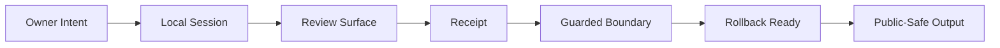
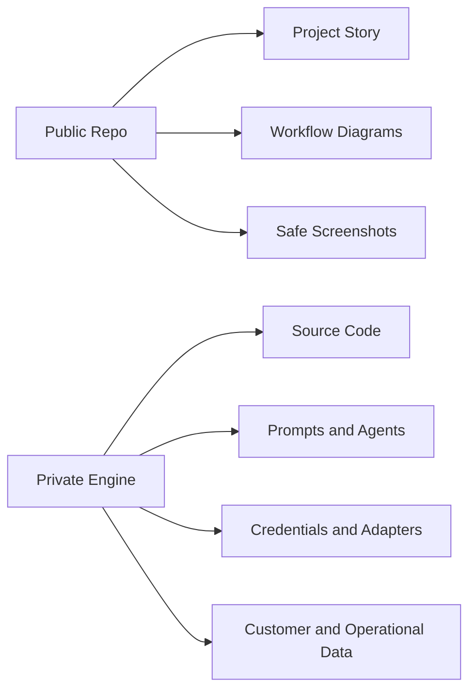

# Workflow Diagrams

These diagrams are public-safe explanations. They do not expose source code, private prompts, agent instructions, credentials, endpoints, adapter logic, or production runbooks.

## Workflow Overview

Source file: [workflow-overview.mmd](../assets/diagrams/workflow-overview.mmd)

SVG: [workflow-overview.svg](../assets/diagrams/workflow-overview.svg)

## Public / Private Boundary

Source file: [public-private-boundary.mmd](../assets/diagrams/public-private-boundary.mmd)

SVG: [public-private-boundary.svg](../assets/diagrams/public-private-boundary.svg)

## Safety Notes

These diagrams explain the public product promise:

- visible workflow
- review points
- receipts
- guarded boundary
- rollback readiness
- public/private separation

They intentionally do not document internal implementation.
