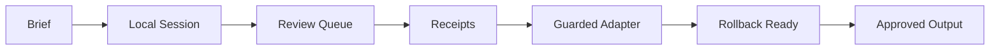
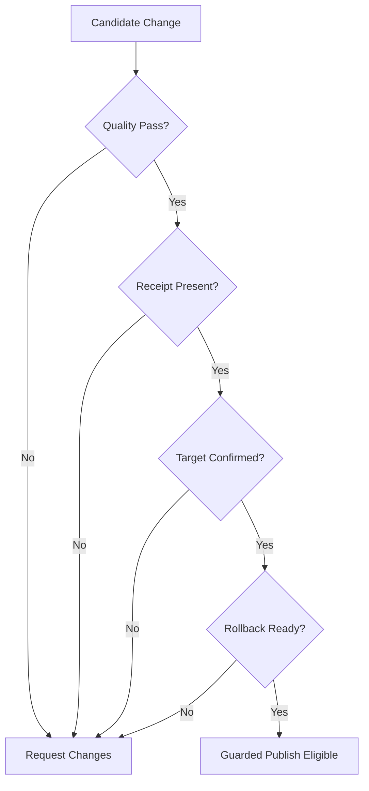
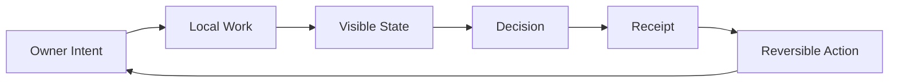

# Fantasia Workflow Maps

These public workflow maps explain how Fantasia works without exposing private source code, credentials, endpoints, adapter logic, or implementation details.

## Real Product Screenshots

Use the actual screenshots page for visuals of what exists now:

- [Actual Product Screenshots](PRODUCT_SCREENSHOTS.md)

The maps below are diagrams only. They are not mockups of app screens.

## How Fantasia Works

This is the public version of the flow. It shows the product promise: local work, review, receipts, controlled publishing, and rollback readiness.

## Publish Safety

This map intentionally avoids naming real production adapters or endpoints. It communicates the guardrails without giving away the internal recipe.

## Owner Control Loop

Fantasia is designed around owner control: know what happened, decide what moves, keep receipts, and stay able to reverse.

## Public Boundary

These maps do not include:

- private source architecture
- endpoint names
- credentials or signing material
- private local paths
- customer data
- implementation-specific adapter logic
- production runbooks

Use them for GitHub, investor overview, pitch materials, and public product explanation only as workflow diagrams.
